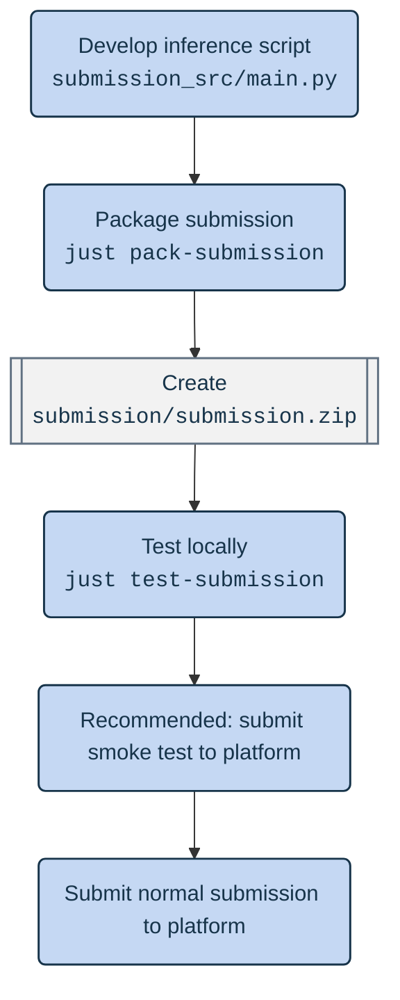

# Trace the Ace: Tutoring Outcomes Predictions Challenge Runtime

 [![DrivenData Trace the Ace](https://img.shields.io/badge/DrivenData-Trace%20the%20Ace-white?logo=data\:image/png;base64,iVBORw0KGgoAAAANSUhEUgAAABAAAAAQCAYAAAAf8/9hAAAABGdBTUEAALGPC/xhBQAABBlpQ0NQa0NHQ29sb3JTcGFjZUdlbmVyaWNSR0IAADiNjVVdaBxVFD67c2cjJM5TbDSFdKg/DSUNk1Y0obS6f93dNm6WSTbaIuhk9u7OmMnOODO7/aFPRVB8MeqbFMS/t4AgKPUP2z60L5UKJdrUICg+tPiDUOiLpuuZOzOZabqx3mXufPOd75577rln7wXouapYlpEUARaari0XMuJzh4+IPSuQhIegFwahV1EdK12pTAI2Twt3tVvfQ8J7X9nV3f6frbdGHRUgcR9is+aoC4iPAfCnVct2AXr6kR8/6loe9mLotzFAxC96uOFj18NzPn6NaWbkLOLTiAVVU2qIlxCPzMX4Rgz7MbDWX6BNauuq6OWiYpt13aCxcO9h/p9twWiF823Dp8+Znz6E72Fc+ys1JefhUcRLqpKfRvwI4mttfbYc4NuWm5ERPwaQ3N6ar6YR70RcrNsHqr6fpK21iiF+54Q28yziLYjPN+fKU8HYq6qTxZzBdsS3NVry8jsEwIm6W5rxx3L7bVOe8ufl6jWay3t5RPz6vHlI9n1ynznt6Xzo84SWLQf8pZeUgxXEg4h/oUZB9ufi/rHcShADGWoa5Ul/LpKjDlsv411tpujPSwwXN9QfSxbr+oFSoP9Es4tygK9ZBqtRjI1P2i256uv5UcXOF3yffIU2q4F/vg2zCQUomDCHvQpNWAMRZChABt8W2Gipgw4GMhStFBmKX6FmFxvnwDzyOrSZzcG+wpT+yMhfg/m4zrQqZIc+ghayGvyOrBbTZfGrhVxjEz9+LDcCPyYZIBLZg89eMkn2kXEyASJ5ijxN9pMcshNk7/rYSmxFXjw31v28jDNSpptF3Tm0u6Bg/zMqTFxT16wsDraGI8sp+wVdvfzGX7Fc6Sw3UbbiGZ26V875X/nr/DL2K/xqpOB/5Ffxt3LHWsy7skzD7GxYc3dVGm0G4xbw0ZnFicUd83Hx5FcPRn6WyZnnr/RdPFlvLg5GrJcF+mr5VhlOjUSs9IP0h7QsvSd9KP3Gvc19yn3Nfc59wV0CkTvLneO+4S5wH3NfxvZq8xpa33sWeRi3Z+mWa6xKISNsFR4WcsI24VFhMvInDAhjQlHYgZat6/sWny+ePR0OYx/mp/tcvi5WAYn7sQL0Tf5VVVTpcJQpHVZvTTi+QROMJENkjJQ2VPe4V/OhIpVP5VJpEFM7UxOpsdRBD4ezpnagbQL7/B3VqW6yUurSY959AlnTOm7rDc0Vd0vSk2IarzYqlprq6IioGIbITI5oU4fabVobBe/e9I/0mzK7DxNbLkec+wzAvj/x7Psu4o60AJYcgIHHI24Yz8oH3gU484TastvBHZFIfAvg1Pfs9r/6Mnh+/dTp3MRzrOctgLU3O52/3+901j5A/6sAZ41/AaCffFUDXAvvAAAAIGNIUk0AAHomAACAhAAA+gAAAIDoAAB1MAAA6mAAADqYAAAXcJy6UTwAAABEZVhJZk1NACoAAAAIAAIBEgADAAAAAQABAACHaQAEAAAAAQAAACYAAAAAAAKgAgAEAAAAAQAAABCgAwAEAAAAAQAAABAAAAAA/iXkXAAAAVlpVFh0WE1MOmNvbS5hZG9iZS54bXAAAAAAADx4OnhtcG1ldGEgeG1sbnM6eD0iYWRvYmU6bnM6bWV0YS8iIHg6eG1wdGs9IlhNUCBDb3JlIDUuNC4wIj4KICAgPHJkZjpSREYgeG1sbnM6cmRmPSJodHRwOi8vd3d3LnczLm9yZy8xOTk5LzAyLzIyLXJkZi1zeW50YXgtbnMjIj4KICAgICAgPHJkZjpEZXNjcmlwdGlvbiByZGY6YWJvdXQ9IiIKICAgICAgICAgICAgeG1sbnM6dGlmZj0iaHR0cDovL25zLmFkb2JlLmNvbS90aWZmLzEuMC8iPgogICAgICAgICA8dGlmZjpPcmllbnRhdGlvbj4xPC90aWZmOk9yaWVudGF0aW9uPgogICAgICA8L3JkZjpEZXNjcmlwdGlvbiPgoICAgPC9yZGY6UkRGPgo8L3g6eG1wbWV0YT4KTMInWQAAAGZJREFUOBFj/HdD5j8DBYCJAr1grSzzmDRINiNFbQ8jTBPFLoAZNHA04/O8g2THguQke0aKw4ClX5uw97vS7eGhjq6aYhegG0h/PuOfohCyYoGlbw04XCgOA8bwI7PIcgEssCh2AQDqYhG4FWqALwAAAABJRU5ErkJggg==)](https://platform.k12-ai-infrastructure.org/competitions/3/tutoring-outcomes/)

Welcome to the runtime repository for the [Trace the Ace: Tutoring Outcomes Prediction Challenge](https://platform.k12-ai-infrastructure.org/competitions/3/tutoring-outcomes/) through the K-12 AI Infrastructure Program!

This repository is the **source of truth for the official competition runtime**: the Docker image and Python environment your `submission.zip` runs in on the platform. It also includes tooling to build, test, and debug submissions locally before you upload them.

The repository includes:

1. **Submission template** ([`examples/template/`](./examples/template/main.py)) — function signatures to implement in your submission.
2. **Example submissions** — runnable demos that produce valid outputs:
   - [`examples/minimal/`](./examples/minimal/main.py) — loads data, model assets, and writes `submission.csv`.
3. **Runtime environment** ([`runtime/`](./runtime/)) — the Docker image definition, entrypoint, and locked Python dependencies.

You can use this repository to:

🔧 **Test your submission** — Run your code in a locally running copy of the competition runtime to catch errors before submitting on the competition website.

📦 **Check what packages are supported** — Submissions do not have general internet access at execution time, so every dependency must be pre-installed in the official image. The specification of what packages are available during execution can be found in the `runtime/` directory.

🏗️ **Request changes to the official runtime** — If you need a package that is not already available, open a pull request to this repository. Maintainers review proposed dependency changes here before they are published to the competition environment.

Changes to the repository are documented in [CHANGELOG.md](./CHANGELOG.md).

---

#### [1. Quickstart](#quickstart)

- [Running a submission locally](#quickstart)
- [Prerequisites](#prerequisites)
- [Data for testing](#data-for-testing)

#### [2. Additional submission guidance](#additional-submission-guidance)

- [Code submission format](#code-submission-format)
- [Runtime network access](#runtime-network-access)
- [Smoke tests](#smoke-tests)

#### [3. Requesting changes to the official runtime](#requesting-changes-to-the-official-runtime)

- [Runtime specification](#runtime-specification)
- [How to propose a new package](#how-to-propose-a-new-package)

#### [4. `just` commands](#just-commands)

---

## Quickstart

The key steps to running a submission locally, from pulling the image to producing `submission.csv`, are:

1. Install the [**prerequisites**](#prerequisites) and optionally **set up testing [data](#data-for-testing)**. Provided demo data will be used by default.
2. **Open Docker**. The following commands must be executed with Docker running
3. Download the official **runtime image** from Azure Container Registry:

    ```sh
    just pull
    ```

    To use a local image instead of the official image, run `just build` instead. A locally built image takes precedence over a pulled one. Set `SUBMISSION_IMAGE` in `.env` to force a specific image.

4. **Build `submission/submission.zip`**. To build a submission from the minimal example (`examples/minimal`), run:

    ```sh
    just pack-example minimal
    ```
    
    To build a submission from your own code, place your submission files (including `main.py` and any model assets) in `submission_src/`. Then run:

    ```sh
    just pack-submission
    ```
    
5. **Run inference** in the runtime container:

    ```sh
    just test-submission
    ```

    The [entrypoint](./runtime/entrypoint.sh) unzips `submission/submission.zip` into `/code_execution/`, runs `python main.py`, and copies the resulting `submission.csv` back to `submission/submission.csv` on your machine. Logs stream to the terminal and are written to `submission/log.txt`.

🎉 **Congratulations!** If everything worked, `submission/submission.csv` and `submission/log.txt` were created on your machine — you've completed a full local test run.

### Prerequisites

To run submissions locally, you'll need:

- A clone of this repository
- [Docker](https://docs.docker.com/get-docker/)
- At least 13 GB of free disk space for the GPU runtime image
- [just](https://github.com/casey/just) (command runner used throughout this repo)
- [uv](https://docs.astral.sh/uv/) (for lockfile management and `uvx` tooling)

Additional requirements for GPU execution:

- [NVIDIA drivers](https://docs.nvidia.com/cuda/cuda-installation-guide-linux/index.html#package-manager-installation) with CUDA 12
- [NVIDIA Container Toolkit](https://docs.nvidia.com/datacenter/cloud-native/container-toolkit/latest/index.html)

Optional: copy [`.env.example`](./.env.example) to `.env` to override defaults (image name, data directory, network isolation).

### Data for testing

Running `just test-submission` mounts a read-only data directory at `/code_execution/data`. On the official platform, the same path contains the competition test set.

By default, the data from [`data-demo/`](./data-demo/) is mounted and used. `data-demo` is pre-populated with a small sample of synthetic data that matches the actual data format:

```
data-demo/
├── submission_format.csv    # columns and responses expected in the final submission
├── test_features.csv        # one row per response, keyed by `response_id`
└── test_transcripts/
    └── <session_id>.csv     # transcript for each session in test_features.csv
```

To test a submission using a different or larger dataset:

1. Add your data files to a folder. We recommend using `data` because it is already git ignored. Your data directory must match the structure of `data-demo`. **Do not push any actual data to GitHub.**
2. Point `DATA_DIR` to your folder when running `just test-submission`:

```bash
DATA_DIR=/path/to/your/data just test-submission
```

***

## Additional submission guidance

The full details of how your submission should be structured are documented on the [code submission format](https://platform.k12-ai-infrastructure.org/competitions/3/tutoring-outcomes/page/6/) page. A few key tips are highlighted here.

### Basic submission steps

When you make a submission on the DrivenData competition site, we run your submission inside a Docker container, a virtual operating system that allows for a consistent software environment across machines. **The best way to make sure your submission to the site will run is to first run it successfully in the container on your local machine.**

This is what a typical solution development flow looks like. You do all your work in `/submission_src/` and then package that up testing it locally, with smoke tests, and then doing a full run.



### Code submission format

Your code submission is a ZIP archive (for example, `submission.zip`) containing `main.py` at the root. A template is at [`examples/template/main.py`](./examples/template/main.py).

`just pack-submission` and `just pack-example` use [`uvx rpzip`](https://github.com/drivendataorg/repro-zipfile) to create deterministic archives. Validate the archive with `just check-submission`.

When you're ready to submit to the competition, upload the `submission.zip` you packaged (not the generated `submission.csv`) to the [Code jobs page](https://platform.k12-ai-infrastructure.org/competitions/3/submissions/code/). **Before you make a full competition submission, you should (1) test your submission locally using the steps above, and (2) make a smoke test submission to the platform.**

### Runtime network access

In the real competition runtime, all internet access is blocked. By default, the justfile commands similarly disable internet access from the container. Set `BLOCK_INTERNET=false` in `.env` or the environment to allow network access during local runs.

### Smoke tests

When submitting on the platform, you will have the ability to submit "smoke tests". Smoke tests run on a small portion of the training set that is set up to emulate the test set in order to run quickly. They will not be considered for prize evaluation and are intended to let you test your code for correctness.

***

## Requesting changes to the official runtime

This section is for competitors and collaborators who need to **change what ships in the official competition environment** — not just test a personal submission. The workflow on DrivenData's code execution platform uses the Docker image built from this repository. When that image is updated and published, new package versions become available to all competitors on the platform.

Because submissions run without general internet access, you cannot `pip install` at inference time. If your solution needs a library that is not already importable in the runtime, you must request it here.

### Runtime specification

Documentation of currently available packages can be found in the [`runtime/`](./runtime/) directory.

- Abstract Python dependencies are declared in [`pyproject.toml`](./runtime/pyproject.toml)
- The uv lockfile specifying the Python environment is at [`uv.lock`](./runtime/uv.lock)
- The test harness script is [`entrypoint.sh`](./runtime/entrypoint.sh). This is what the container runs that calls your submitted code.
- The Docker image specification is given by [`Dockerfile`](./runtime/Dockerfile)

### Before starting a pull request

- Confirm the package is not already available — run `just build-tests` and `just interact-tests`,
  then try `import <package>` in the test container, or check
  [`runtime/pyproject.toml`](./runtime/pyproject.toml).
- Prefer widely used, well-maintained packages with clear licensing.
- Be prepared to explain why the dependency is needed for the competition task.

### How to propose a new package

Dependencies are managed with [uv](https://docs.astral.sh/uv/) in
[`runtime/pyproject.toml`](./runtime/pyproject.toml). The official runtime uses **Python 3.12**.

If you're new to contributing on GitHub, see [GitHub's guide to contributing to projects](https://docs.github.com/en/get-started/quickstart/contributing-to-projects).

1. **Fork** this repository and create a branch for your change.

2. **Add the dependency** to `runtime/pyproject.toml` under `[project] dependencies` (or the
   appropriate optional/dev group if it is only needed for tests).

3. **Update the lockfile**:

    ```sh
    just update-lockfile
    ```

4. **Verify the lockfile is in sync**:

    ```sh
    just check-lock
    ```

5. **Build and test locally** before pushing:

    ```sh
    just build-tests
    just run-tests
    just build
    ```

    `just run-tests` exercises imports and GPU-related checks in `runtime/tests`. If you added a
    package competitors will rely on, consider adding a test that imports it.

6. **Commit** the updated `runtime/pyproject.toml` and `runtime/uv.lock`.

7. **Open a pull request** to the `main` branch of this repository. In the PR description, explain
   what package you are adding and why competitors need it.

### What happens after you open a PR

CI (see [`.github/workflows/ci.yml`](./.github/workflows/ci.yml)) will:

1. Run `just check-lock` to ensure the lockfile matches `pyproject.toml`.
2. Build the test image and run `just run-tests`.
3. Build the runtime Docker image.

For security reasons, administrators may need to approve the workflow run on your pull request before CI starts. Builds can take up to 30 minutes and may queue behind other jobs.

A DrivenData maintainer will review your PR. You may be asked to revise the change if tests fail, if the dependency is too heavy for the shared runtime, or if there are version-conflict concerns. Pull requests are merged only after CI passes and the team approves the change.

Once merged to `main` and published, the updated image becomes the basis for the official competition runtime. Competitors can then `just pull` to test against the same environment locally.

## `just` commands

Run `just` or `just help` to see available images and commands. Groups from `just --list`:

| Group | Commands |
| --- | --- |
| **test submission locally** | `pull`, `pack-example`, `pack-submission`, `check-submission`, `test-submission`, `interact-container` |
| **development** | `build`, `update-lockfile`, `check-lock`, `debug`, `clean`, `format` |
| **tests** | `build-tests`, `run-tests`, `interact-tests` |

Use `just debug` to print resolved settings (`data_dir`, `submission_image`, network flags, etc.).
